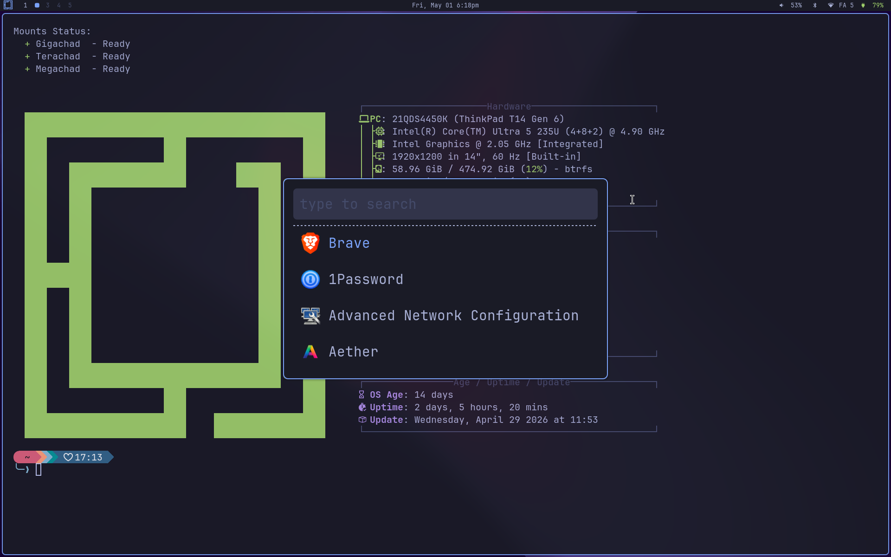
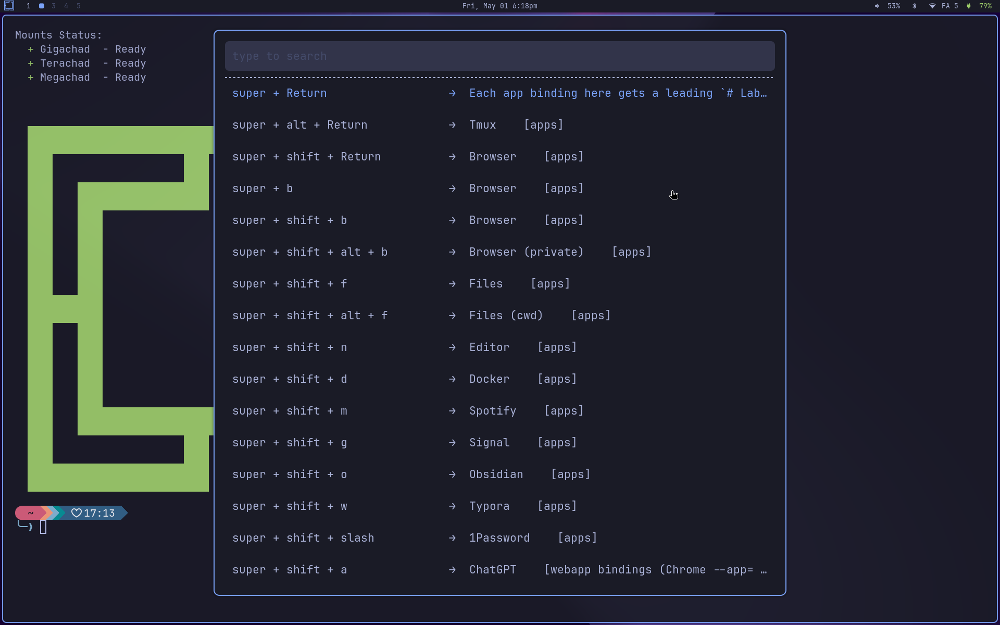
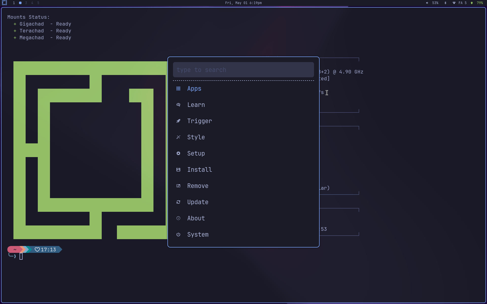
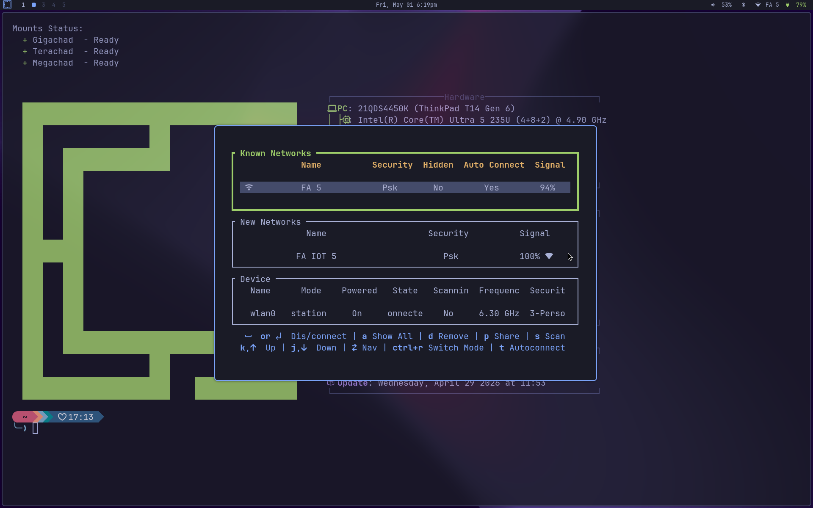
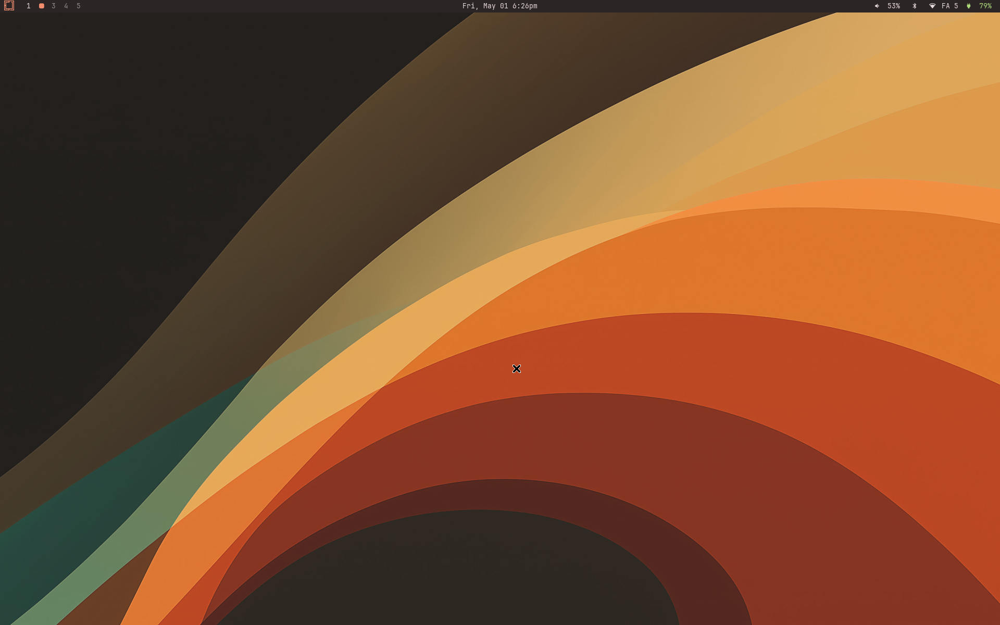
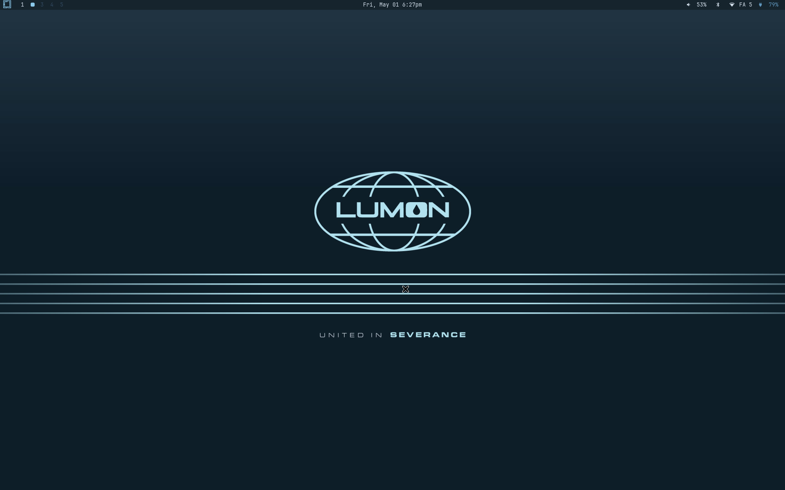
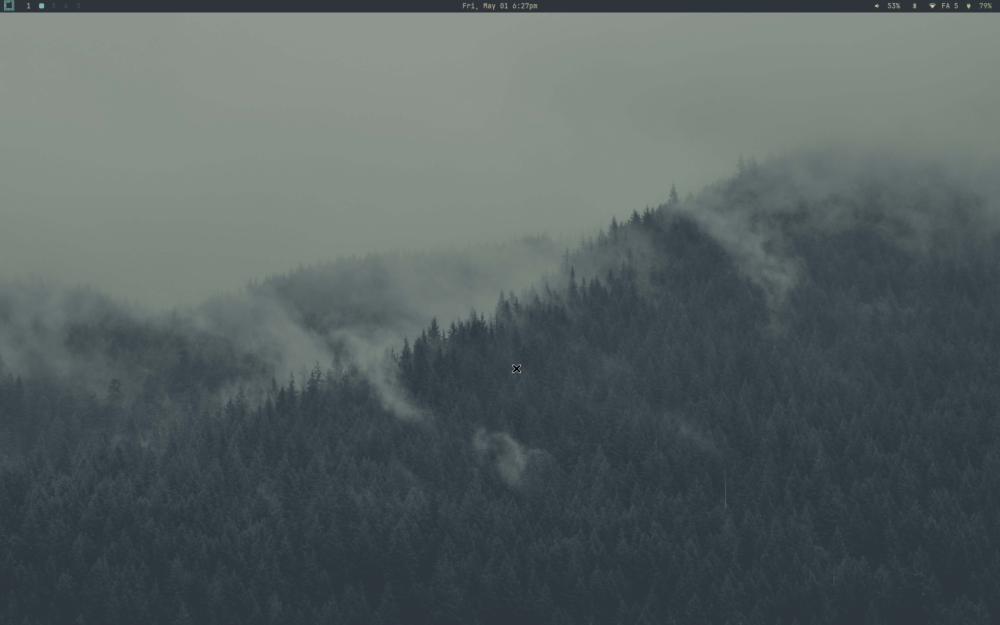
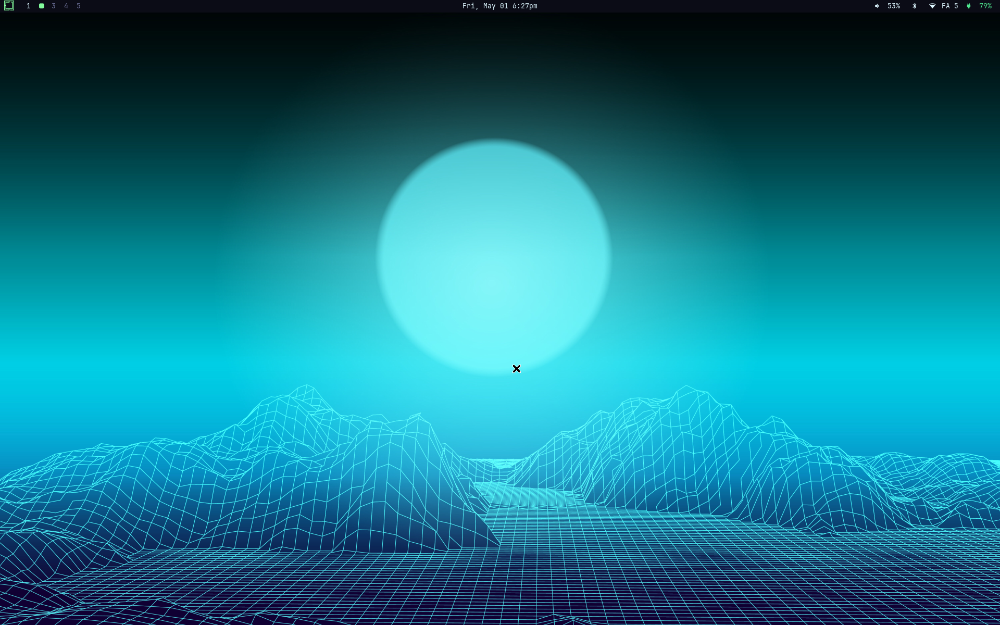

# nw-omarchy

A secondary login option for Omarchy: **bspwm + picom (upstream v13) on XLibre**, layered on top of an existing Omarchy install. Ports as much of the Hyprland look-and-feel and keybindings as the X11 stack allows — rounded corners, blur, shadows, fade-on-open/close — all running on a maintained X server.

> "Not Wayland Omarchy." Sits parallel to Hyprland — your Omarchy session is untouched.

XLibre is the project's X server target (a maintained `xorg-server` fork). It coexists cleanly with omarchy's hyprland (xorg-xwayland is untouched). `install.sh --apply` runs the swap as the last step of the pipeline. See [docs/xlibre.md](docs/xlibre.md) for what it touches and how to revert.

## Screenshots

### Launchers / menus / TUIs

| | |
|---|---|
|  |  |
| **`super + space`** — full drun launcher (every `.desktop` on the system, with icons) | **`super + shift + space`** — pinned-apps cheat-sheet, chord shown next to each binding |
|  |  |
| **`super + alt + space`** — 1:1 port of the omarchy system menu | **`super + ctrl + w`** — impala wifi TUI as a floating overlay (one of the per-app TUI bindings) |

### Themes — every omarchy theme works as-is

nw-omarchy plugs into omarchy's existing `omarchy-theme-set` pipeline: bspwm border, polybar, rofi, and dunst all repaint on every theme change, and the wallpaper rotates with the theme via our [`nw-omarchy-bg-watch`](bin/nw-omarchy-bg-watch) inotify daemon. The 19 themes shipped by omarchy (catppuccin, gruvbox, kanagawa, nord, tokyo-night, …) need zero porting work to look right under bspwm.

| | |
|---|---|
|  |  |
| **ristretto** — warm color-curves wallpaper | **lumon** — Severance "United in Severance" |
|  |  |
| **everforest** — misty tree-tops | **retro-82** — synthwave grid |

## What this is not

- A replacement for Omarchy. Hyprland keeps working. Pick your session at SDDM.
- A fork. Nothing under `~/.local/share/omarchy/` is modified.
- Magic. Wayland-only features (real GPU compositing, native fractional scaling) don't come back; we approximate.

## Quick install (one-liner)

```bash
curl -fsSL https://raw.githubusercontent.com/akitaonrails/NW-Omarchy/master/boot.sh | bash
```

Pre-flights Arch + omarchy + git, clones to `~/.local/share/nw-omarchy`, and runs the full install pipeline (bspwm session + picom v13 + XLibre swap). Asks for confirmation once before touching anything; pass `--yes` to skip:

```bash
curl -fsSL https://raw.githubusercontent.com/akitaonrails/NW-Omarchy/master/boot.sh | bash -s -- --yes
```

Reboot when it finishes, then pick `nw-bspwm` from the SDDM session selector.

## Bootstrap (from a clone)

```bash
cd ~/.local/share/nw-omarchy
./install.sh           # dry-run by default; prints what it would do
./install.sh --apply   # bspwm session + picom v13 + XLibre swap, in one shot
```

Reboot, then pick `nw-bspwm` from the SDDM session selector on next login.

> Pre-1.0: `install.sh --apply` is the canonical path to the latest target state from any starting point. Idempotent — safe to re-run after pulling repo updates. Post-1.0 we'll add proper upgrade migrations.

## Uninstall

```bash
~/.local/share/nw-omarchy/uninstall.sh --apply
```

Reads `~/.local/state/nw-omarchy/manifest.tsv` and undoes everything: removes only packages it installed, restores backed-up configs, deletes the SDDM session entry, wipes state.

## Status / introspection

```bash
nw-omarchy-status        # what's tracked, what would be removed
nw-omarchy-doctor        # lint live install (packages, themes, daemons, ...)
```

## Documentation

- [docs/README.md](docs/README.md) — what works, what doesn't, gotchas
- [docs/architecture.md](docs/architecture.md) — directory layout and conventions
- [docs/gaps.md](docs/gaps.md) — parity with vanilla omarchy: what's done, what's intentionally dropped, what's still worth building
- [docs/porting-hypr.md](docs/porting-hypr.md) — Hyprland binding/feature → X11 map
- [docs/why-xlibre.md](docs/why-xlibre.md) — what XLibre is, why we chose it, what we gain by staying on X11, what we lose vs Hypr/Wayland
- [docs/xlibre.md](docs/xlibre.md) — what the install pipeline does for the X server swap, compatibility matrix, revert recipe

## Repo layout

| Path | Purpose |
|---|---|
| `install.sh` / `uninstall.sh` | Top-level entry points |
| `bin/nw-omarchy-*` | Runtime CLI (install, uninstall, status, track) |
| `install/*.sh` | Idempotent install steps; each calls `nw-omarchy-track` |
| `default/{bspwm,sxhkd,picom,polybar,rofi,xinit}/` | Configs symlinked into `~/.config` |
| `default/xsessions/nw-bspwm.desktop` | The SDDM session file |
| `packages/nw-omarchy.packages` | Pacman/AUR package list |
| `docs/` | The "what worked" docs (omarchy-style) |

## Conventions inherited from Omarchy

- Idempotent scripts (re-running install does nothing on a clean state).
- "Document what worked" — every shipped change reachable from `docs/README.md`.
- Imperative commit subjects, scoped: `bspwm:`, `picom:`, `install:`, `docs:`, `fix(...)`.
- Never edit `~/.local/share/omarchy/` (their tree, clobbered by `omarchy-update`).

## State directory

Install actions are recorded in `~/.local/state/nw-omarchy/`:

```
manifest.tsv     # one row per action: pkg | pkg-skip | file | symlink | dir
backups/         # files we displaced
install.log      # last install run output
```

Uninstall replays this in reverse. Lose the state dir → uninstall becomes manual; back it up if you care.
